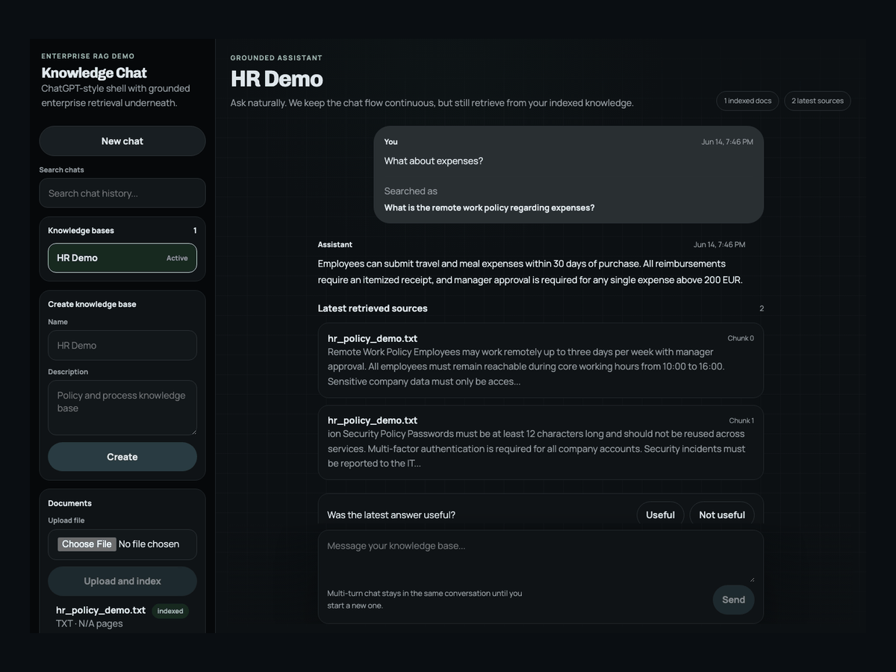

# Enterprise Knowledge Assistant

This project is a single-user, local-first RAG assistant for internal documents. The idea is straightforward: upload a few company-style files, index them into PostgreSQL with `pgvector`, and then ask questions through a chat interface that answers from retrieved context instead of model memory alone.

It was built as an AI engineering portfolio project, so the focus is less on product polish for many users and more on showing the moving parts clearly: ingestion, chunking, embeddings, retrieval, grounded generation, feedback, evaluation, and a backend/frontend split that can be containerized cleanly.

Authentication is intentionally not part of the current milestone. This is the "make the RAG flow work well and be easy to explain" version first.



## What works today

- Create and switch between knowledge bases
- Upload `TXT`, `PDF`, and `DOCX` documents
- Extract text and store document metadata
- Split documents into chunks and generate embeddings
- Store vectors in PostgreSQL with `pgvector`
- Search chunks by semantic similarity inside a selected knowledge base
- Ask questions in a continuous multi-turn chat
- Rewrite follow-up questions into standalone retrieval queries
- Generate grounded answers with source citations
- Stream chat responses from the backend
- Save chat history and delete old conversations
- Capture simple feedback (`useful` / `not useful`)
- Run evaluation sets against a knowledge base
- View basic analytics such as document count, chunk count, feedback ratio, and average latency

## Architecture at a glance

The system has four main parts:

1. A React frontend for the demo UI
2. A FastAPI backend for ingestion, retrieval, chat, evaluation, and analytics
3. PostgreSQL with `pgvector` for metadata, chats, and embeddings
4. Gemini models for answer generation, follow-up query rewriting, and embeddings

The high-level flow looks like this:

```text
Document upload
  -> text extraction
  -> chunking
  -> embedding generation
  -> chunks + vectors stored in Postgres

User question
  -> follow-up rewrite if needed
  -> query embedding
  -> vector search in selected knowledge base
  -> grounded prompt with retrieved context
  -> LLM answer
  -> citations + retrieval logs + chat history saved
```

## Why knowledge bases and documents are separate

A knowledge base is a logical container like `HR`, `Finance`, or `Legal`.

A document is one uploaded file inside that container.

Keeping them separate matters because:

- one knowledge base can contain many documents
- retrieval should stay scoped to the selected knowledge base
- the UI can switch context cleanly without mixing unrelated material
- later, access control can be added at the knowledge-base level without redesigning the whole model

In short: the knowledge base is the collection, the document is one source inside it.

## How ingestion works

When a file is uploaded, the backend:

1. Validates the file type and size
2. Stores the raw file under `backend/uploads`
3. Creates a document record with `processing` status
4. Extracts text from the file
5. Splits that text into chunks
6. Generates an embedding per chunk
7. Stores the chunks and vectors
8. Marks the document as `indexed`

If something fails during extraction or indexing, the document is marked as `failed`.

The upload endpoint is in [backend/app/api/endpoints/documents.py](backend/app/api/endpoints/documents.py), and the indexing logic lives in [backend/app/services/ingestion.py](backend/app/services/ingestion.py).

## How retrieval works

Retrieval is the part that decides which chunks the model is allowed to see before answering.

The backend does not search the entire database blindly. It does this instead:

1. Start from the user's latest question
2. If the question is a follow-up, rewrite it into a standalone query
3. Generate an embedding for that retrieval query
4. Search the `chunks` table for the nearest vectors
5. Filter results to the selected knowledge base
6. Take the top `k` chunks
7. Build a context block from those chunks

That means the model never receives "all company knowledge". It only receives a small retrieved context window for the current question.

The main retrieval logic is in [backend/app/services/rag_pipeline.py](backend/app/services/rag_pipeline.py).

## How answer generation works

Once retrieval finishes, the backend builds a grounded prompt with:

- recent conversation history
- the retrieved chunk context
- the latest user question
- a strict instruction to answer only from the provided context

If no relevant context is found, the assistant should refuse cleanly instead of inventing an answer.

The project currently uses Gemini for:

- main answer generation
- follow-up query rewriting
- embeddings (`gemini-embedding-001`)

Model calls are wrapped in [backend/app/services/llm_client.py](backend/app/services/llm_client.py).

## How citations work

Every grounded answer is paired with citations built from the retrieved chunks. Each citation includes:

- document name
- chunk id
- chunk index
- a short snippet

Those citations are shown in the chat UI so it is visible where the answer came from.

This is not a perfect trust guarantee, but it is much better than a plain model answer with no retrieval trace.

## How evaluation works

The evaluation module lets you define a small set of test questions with expected answers and then run them against a knowledge base. It is there for one reason: to make the project measurable.

Without evaluation, a RAG app can feel "pretty good" right up until it fails on an important question.

This project includes endpoints for:

- creating evaluation sets
- adding questions to a set
- running an evaluation set against a knowledge base

The demo seed now includes a 10-question evaluation set built around the sample HR policy document.

The evaluation endpoints live in [backend/app/api/endpoints/evaluation.py](backend/app/api/endpoints/evaluation.py).

## Tech stack

- Python 3.12
- FastAPI
- SQLAlchemy
- PostgreSQL
- `pgvector`
- React
- Vite
- Nginx for serving the built frontend container
- Gemini API for generation and embeddings
- Docker Compose

## Project layout

```text
enterprise-knowledge-assistant/
  backend/
    app/
      api/
      core/
      db/
      models/
      schemas/
      services/
    uploads/
    Dockerfile
    requirements.txt
  demo/
    hr_policy_demo.txt
    README.md
  frontend/
    src/
    Dockerfile
    nginx.conf
    package.json
  docker-compose.yml
  .env.example
  README.md
```

## Screenshots

Current demo screenshots live in [docs/screenshots/README.md](docs/screenshots/README.md).

- [Chat overview](docs/screenshots/chat-overview.png)
- [Retrieved sources panel](docs/screenshots/sources-panel.png)
- [Sidebar workspace state](docs/screenshots/sidebar-workspace.png)
- [Short demo GIF](docs/screenshots/demo-walkthrough.gif)

## Local setup

### Prerequisites

- Python 3.12
- Node.js 22 or close
- PostgreSQL with `pgvector` enabled
- A Gemini / Google API key

### 1. Create the environment file

```bash
cp .env.example .env
```

Then fill in `GOOGLE_API_KEY` and adjust the Postgres values if needed.

### 2. Install backend dependencies

```bash
python3 -m venv venv
source venv/bin/activate
pip install -r backend/requirements.txt
```

### 3. Install frontend dependencies

```bash
cd frontend
npm install
cd ..
```

### 4. Start PostgreSQL

Use your local Postgres instance and make sure the `vector` extension is available in the target database.

### 5. Start the backend

```bash
source venv/bin/activate
python3 -m uvicorn backend.app.main:app --reload
```

API base URL:

```text
http://127.0.0.1:8000/api
```

Health check:

```text
http://127.0.0.1:8000/health
```

### 6. Start the frontend

```bash
cd frontend
npm run dev
```

Frontend URL:

```text
http://127.0.0.1:5173
```

## Docker setup

The repository now includes:

- [docker-compose.yml](docker-compose.yml)
- [backend/Dockerfile](backend/Dockerfile)
- [frontend/Dockerfile](frontend/Dockerfile)

To run the full stack with Docker:

```bash
cp .env.example .env
docker compose up --build
```

Expected ports:

- frontend: `http://localhost:5173`
- backend: `http://localhost:8000`
- postgres: `localhost:5432`

Notes:

- the backend container talks to the database through the Compose service name `db`, not `localhost`
- the frontend is built with `VITE_API_BASE_URL=http://localhost:8000/api`
- uploaded files are stored in a named Docker volume
- Postgres data is stored in a named Docker volume

## Running tests

Backend tests are currently lightweight and focused on the core pipeline behavior.

Run them with:

```bash
./venv/bin/pytest backend/tests -q
```

Current coverage includes:

- upload flow
- chunking behavior
- retrieval logic
- grounded chat answer flow
- evaluation scoring
- health endpoint
- duplicate knowledge base protection
- feedback validation for missing conversations
- document loader behavior

## Environment variables

The important variables are:

- `GOOGLE_API_KEY`
  - required for Gemini calls
- `GEMINI_MODEL`
  - primary generation model
- `GEMINI_FALLBACK_MODELS`
  - ordered fallback list if the primary model is unavailable
- `EMBEDDING_MODEL`
  - current embedding model
- `EMBEDDING_DIMENSION`
  - must match the vector size stored in the database
- `DATABASE_URL`
  - SQLAlchemy connection string for local runs
- `POSTGRES_*`
  - database settings used by both local runs and Docker Compose
- `VITE_API_BASE_URL`
  - backend URL baked into the frontend at build time

The full example lives in [.env.example](.env.example).

## Main API routes

The backend is centered around these route groups:

- `/health`
- `/api/knowledge-bases`
- `/api/documents`
- `/api/chat`
- `/api/feedback`
- `/api/evaluation`
- `/api/analytics`

Useful examples:

- `POST /api/documents/upload`
- `POST /api/chat`
- `POST /api/chat/stream`
- `POST /api/evaluation/run`
- `GET /api/analytics`

## Demo flow

If you just want to see the project working end to end:

1. Create a knowledge base, for example `HR Demo`
2. Upload [demo/hr_policy_demo.txt](demo/hr_policy_demo.txt)
3. Open the chat UI
4. Ask something simple like:
   - `What is the remote work policy?`
   - `How should expenses be submitted?`
5. Inspect the retrieved sources under the answer
6. Ask a follow-up question and watch the retrieval query rewrite keep the conversation grounded
7. Mark the answer as useful or not useful
8. Open analytics and evaluation views to inspect the demo state

There is also a small demo walkthrough in [demo/README.md](demo/README.md).

## Current limitations

This is a solid project demo, but it is still a demo. The main gaps are:

- no authentication or user management yet
- no background job queue for large document processing
- no hybrid search or reranking yet
- evaluation is basic, not a full offline benchmark framework
- backend test coverage is still small and focused; it is not a full integration test harness yet
- no formal migrations yet; the app currently initializes tables on startup

## Next improvements

If I were pushing this beyond the current milestone, I would build these next:

- Alembic migrations instead of startup schema mutation
- hybrid retrieval with keyword search plus vector search
- reranking before final prompt construction
- background processing for larger files
- auth and access control at the knowledge-base level
- cleaner admin-style analytics and evaluation screens

## A note on the project goal

This repository is meant to show systems thinking more than product completeness.

The interesting part is not that "an LLM answers questions." The interesting part is that the answer is shaped by a pipeline you can inspect and explain: document ingestion, chunking decisions, embedding storage, retrieval scope, grounded prompting, citations, feedback, and evaluation.
